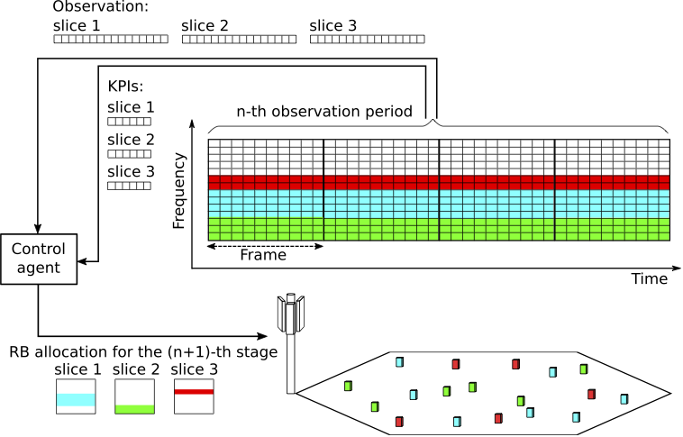
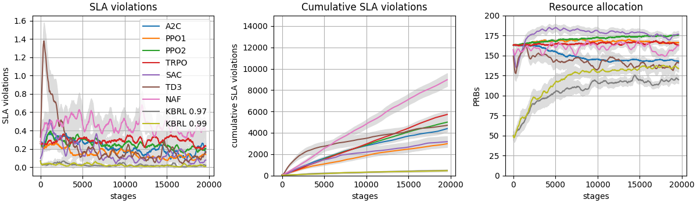

# Network slicing environment

## Description

Source code of the paper "[Model-Based Reinforcement Learning with Kernels for Resource Allocation in RAN Slices](https://doi.org/10.1109/TWC.2022.3195570)" published in IEEE Transactions on Wireless Communications. The code provides a network slicing environment where time-frequency resources must be allocated among several network slices in consecutive decision stages. The environtment implements the OpenAI Gym https://github.com/openai/gym interface and can interact Stable-Baselines RL agents https://github.com/hill-a/stable-baselines and Keras-RL agents https://github.com/keras-rl/keras-rl. Additionally, the code includes a novel model-based RL control algorithm (KBRL). At each decision stage, the control agent observes a set of variables describing the state of the system. Based on these observations, the agent makes a resource allocation decision specifying the resource blocks, RBs, assigned to each slice for a number of upcoming radio frames (observation period). At the end of each observation period, the agent receives a signal indicating the fulfillment or violation of the service level agreement (SLA) for each slice during that period. The end of an observation period determines the start of a new decision stage. The objective of the control agent is to allocate the resources efficiently (i.e. use the minimum required number of RBs) while statisfying the SLAs of the network slices.



## Acknowledgements

This work was supported by project grant PID2020-116329GB-C22 funded by MCIN / AEI / 10.13039/501100011033  


## How to use it

### Requirements

The enviroment requires Open-AI gym, Numpy and Pandas packages. The RL agents are provided by stable-baselines (version 2, which uses TensorFlow), and the scripts for plotting results use scipy and matplotlib. The following versions of these packages are known to work fine with the environment:  

gym==0.15.3  
numpy==1.19.1  
pandas==0.25.2  
stable-baselines==2.10.1  
tensorflow==1.9.0  
scipy==1.5.4  
matplotlib==3.3.4  

To run the NAF agent, Keras and Keras-RL are also required. The tested versions are:  
Keras==2.2.1  
keras-rl==0.4.2  

It is recommended to use a python virtual environment to install the above packages.

### Instalation

1. Clone or download the repository in your local machine

2. Open a terminal window and (optionally) activate the virtual environment

3. Go to the gym-ran_slice folder in the terminal window 

4. Once in the gym-ran_slice folder run:
```python
pip install -e .
```

### Experiment scripts

There are four scripts for launching simulation experiments:

- experiments_rl.py: runs the experiments with the RL agents of stable-baselines  
- experiments_kbrl.py: runs the experiments with the proposed KBRL algorithm  
- experiments_naf.py: runs the experiments with the NAF algorithm provided by keras-rl  
- experiment_dqn.py: runs the experiments with the DQN algorithm provided by stable-baselines  

And four scripts for plotting results:  

- plot_results.py: plots the learning curves of the algorithms in the scenario given as a input (e.g. ```python plot_results.py 0``` plots paper's figure 3)  
- plot_trained_results.py: plots the performance metrics during the inference phase of the MBRL algorithms (paper's figure 6)  
- plot_adjustment_results.py: plots the adjustment rate of KBRL (paper's figure 7)  
- plot_accuracy_results.py: plots the accuracy of KBRL (paper's figure 8)
- plot_oracle_results.py: plots the performance metrics of KBRL, DNQ, NAF and ORACLE (paper's figure 10)  

Figure 3 of the paper showing the performance curves for a scenario with 5 eMMB RAN slices, where KBRL attains the lowest rate of SLA violations while using less resources than model-free RL algorithms:
  

## Project structure

The following files implement the environment:  

- node_b.py  
- slice_ran.py  
- slice_l1.py  
- channel_models.py  
- traffic_generators.py  
- schedulers.py  
- ./gym-ran_slice/gym_ran_slice/ran_slice.py  

The KBRL agent is implemented in:

- kbrl_control.py
- ./algorithms/kernel.py
- ./algorithms/projectron.py

The following files are required to build the experiments:

- scenario_creator.py: creates the environments and the KBRL agents  
- wrapper.py: allows the interaction with stable-baselines  
- naf_agent_creator.py: creates NAF agents   

## How to cite this work

The code of this repository:

@misc{net_slice,  
    title={Network slicing environment},  
    author={Juan J. Alcaraz},  
    howpublished = {\url{https://github.com/jjalcaraz-upct/network-slicing/}},  
    year={2022}  
}

The paper where KBRL was presented:

@misc{alcaraz2022,
  author = {Alcaraz, Juan J. and Losilla, Fernando and Zanella, Andrea and Zorzi, Michele},  
  title = title = {Model-{Based} {Reinforcement} {Learning} {With} {Kernels} for {Resource} {Allocation} in {RAN} {Slices}},,   
  publisher = {IEEE},  
  journal = {IEEE Transactions on Wireless Communications},  
  year = {2023},
  month = {1},
  pages = {486--501},
  volume = {22},
}

## Licensing information

This code is released under the MIT lisence.
